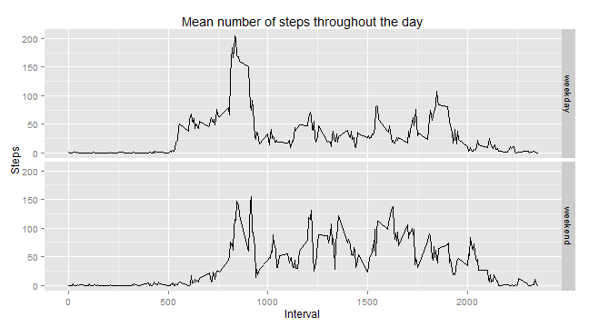

Reproducible Research Assignment 1
==============================================

###1. Load the data and necessary packages:  


```r
library("ggplot2")
library("dplyr")

unzip("activity.zip")
df <- read.table("activity.csv", header = T, sep = ",", na.strings = "NA")
```

###2. Preprocessing steps:  

Format date data and minute interval data.       

```r
# the date data
df$date <- as.Date(df$date, "%Y-%m-%d")

# the time interval data
df <- mutate(df, H = interval %/% 100, M = interval %% 100) # use dplyr to cut hours and minutes.
```

###3. What is the total number of steps taken per day? 

sum up the number of steps taken each day, ignoring missing cases.   

```r
stepsXday <- aggregate(steps ~ date, df, sum)
```

Plot a histogram.    

```r
p <- ggplot(stepsXday,aes(date,steps))  
    
p <- p + geom_histogram(stat = "identity",
        binwidth = 1, aes(fill = steps)) + scale_fill_gradient("Count",
        low = "blue", high = "red") 
    
p <- p + scale_x_date(breaks = "1 week", minor_breaks = "1 day") +
        labs(title = "Total steps per day",x = "Date", y = "Steps")

p <- p + theme_bw()

print(p)
```

 


The mean number of steps taken per day is **1.0766189 &times; 10<sup>4</sup>**.  
The median number of steps taken per day is **10765**.  

###4. What is the average daily activity pattern?

Calculate average number of steps for each time interval, across all days.


```r
stepsXtime <- aggregate(steps ~ interval, df, mean)

p <- ggplot(stepsXtime, aes(interval,steps)) + geom_line(size = 1)
p <- p + labs(title = "Mean number of steps throughout the day", x = "Interval", y = "Steps")

print(p)
```

 


###5. Imputing missing values


There are **2304** missing values in the dataset. 

Impute the missing values by assigning the median for the interval of the missing value across days.  
This is *the* most inelegant approach ever but I don't have a handle on dplyr, aggregate, etc.


```r
for (i in 1:nrow(df)){
    
    interval_idx <- which(df[,3] == df[i,3])
    
    if (is.na(df[i,1])) {
        
        df[i,1] <- median(df[interval_idx,1], na.rm = TRUE)
    }
        
    if (is.na(df[i,1])){ # if it's still NA, then there were no good values
            df[i,1] <- 0 # set it to zero
    }       
}
```

New histogram with values imputed.    

```r
stepsXday <- aggregate(steps ~ date, df, sum)

p <- ggplot(stepsXday,aes(date,steps))  
    
p <- p + geom_histogram(stat = "identity",
        binwidth = 1, aes(fill = steps)) + scale_fill_gradient("Count",
        low = "blue", high = "red") 
    
p <- p + scale_x_date(breaks = "1 week", minor_breaks = "1 day") +
        labs(title = "Total steps per day",x = "Date", y = "Steps")

p <- p + theme_bw()

print(p)
```

 


The mean number of steps taken per day is **9503.8688525** for the imputed data set.  
The median number of steps taken per day is **1.0395 &times; 10<sup>4</sup>** for the imputed data set.  
It appears both the mean *and* median number of steps per day has gone down when the missing values are imputed.  

###6. Are there differences in activity patterns between weekdays and weekends?


```r
days<-weekdays(df$date,abbreviate=TRUE)
weekdayidx <- grep("Mon|Tue|Wed|Thu|Fri",days)
weekendidx <- grep("Sat|Sun",days)
days[weekdayidx] <- "weekday"
days[weekendidx] <- "weekend"
df$days <- as.factor(days)

byday <- summarise(group_by(df,interval,days),steps = mean(steps))

p <- ggplot(byday, aes(interval,steps)) + geom_line()
p <- p + facet_grid(days ~.)
p <- p + labs(title = "Mean number of steps throughout the day", x = "Interval", y = "Steps") 

print(p)
```

 

It appears that the individual is more active during the middle hours of the day during the weekend and less active in the early morning. 
